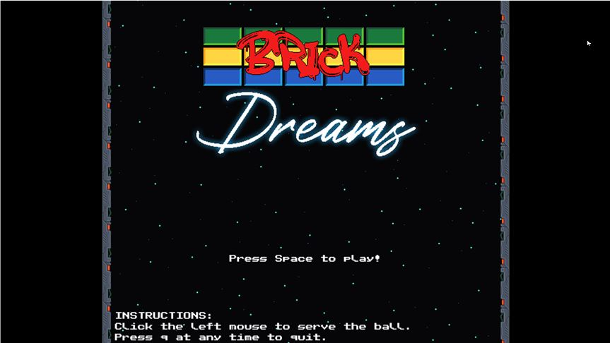
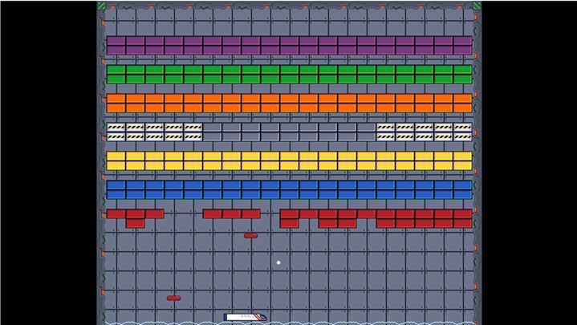

# SDL Experiments

## Background

In mid 2023 I decided to have another run at learning C++/SDL2. Since my last attempt I had been doing a lot more Python development at work and my most recent job saw me tacking Go which gave me a bit of a boost in my motivation. I knew I wasn't going to be writing great code out of the gate and that I would prefer "Complete" over "Perfect". As such I decided to tackle a few smaller projects so that I could make mistakes early and on a smaller scale. 

The guiding principles I adopted were:

	1. Complete what you start
	2. Self-review for improvement
	3. Build Improvements into the next Project

My hope is that as I become more familiar with the language and the patterns is that I spend less time thinking about how to do things, and more time implementing good design practices. Until then there are going to be a lot to improve upon.

Contained within these folders are the results of those projects. You should not use the code contained within for any real purposes as it represents a developer new to the language grasping around and attempting to improve their skills.

## Pong (Dev Time: Two Weeks)

 

This was just a first cut at getting something up and going so I chose the classic game Pong. It works but it's locked to a single screen resolution and I'm just drawing rects for now. By far the collision implementation took the longest to get right, both in my understanding of it and in formulating a response to the ball colliding with the paddle. As the paddle can move into the ball this makes the collision detection more complicated than just checking where the ball is. In comparison to other projects I have worked on in the past I made heavy use of GDB. When you're debugging physics at 60FPS it can be tough to keep track of what's going on. Even if you log everything out you just end up with pages and pages of data. 

## Muddy Puddle Jump (Dev Time: One Week)

 

After Pong I created this quickly in a week to teach my son mouse movement. You move the character to the puddle and they will jump up and down, you have to do it as many times as you can in 60 seconds. I lifted a lot of code from Pong and added the Sprite support. The project is badly implemented as almost all the logic is stored in the Play state due to the short development timeframe. It also only supports 1920x1080.

## Brick Dreams (Dev Time: Two Months so far)

 

For this project I chose to emulate a game in the Breakout genre. In this project the issues with the Singleton pattern became apparant as such I ended up replacing most, if not all of them. Once again I have discovered that I have no real desire to implement physics or collision detection myself and will probably use Bullet or Box2d for future projects. I did end up bringing in spdlog to handle logging and I think this will mark a shift away from doing everything myself to attempting to use more libraries. When developing solo with only a few hours of free time a night you can easily lose a few weeks hunting down problems in your own code.

Issues with resolving collision detection remain especially for cases where both the player and another target can move. I wanted to only check collision against the ball but this can complicate things where the player can move the paddle as fast as they can move the mouse. The player controls simply map the mouse coordinates to the paddle so it can move pretty quickly. As such it leads to the ugly hack where if the paddle moves into the ball we simply place it above the paddle. This causes other issues and may not be a permenant fix. There were some issues surrounding the ball being close to two things at once and moving inside the second thing after colliding with the first thing. The simplest, but probably not the best approach was to check if the ball was inside anything after the update had completed and move it back if it was.

The State Machine pattern proves very useful and is used in the main game state (Main Menu/Exit/Playing/GameOver), as a sub state in the Playing State itself (Playing, Dying, Serving, LevelWin, LoadLevel). I'll probably also attach a state machine to the player to handle powerups and it may also factor into enemy movement.

