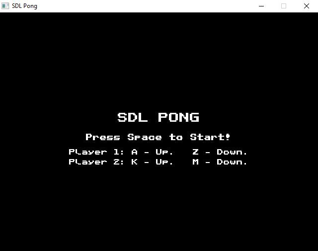
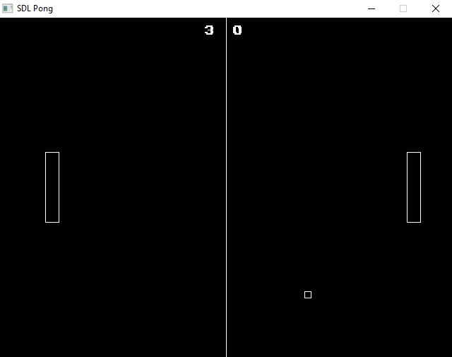
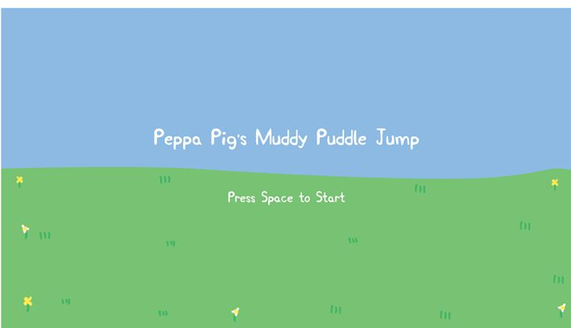
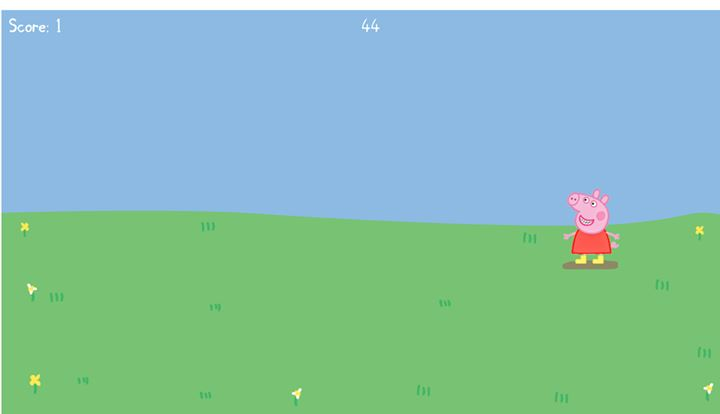
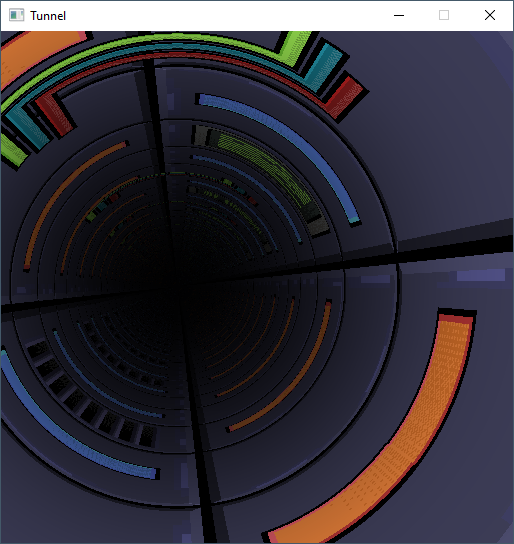

# SDL Experiments

## Background

In mid 2023 I decided to have another run at learning C++/SDL2. Since my last attempt I had been doing a lot more Python development at work and my most recent job saw me tacking Go which gave me a bit of a boost in my motivation. I knew I wasn't going to be writing great code out of the gate and that I would prefer "Complete" over "Perfect". As such I decided to tackle a few smaller projects so that I could make mistakes early and on a smaller scale. 

The guiding principles I adopted were:

	1. Complete what you start
	2. Self-review for improvement
	3. Build Improvements into the next Project

My hope is that as I become more familiar with the language and the patterns is that I spend less time thinking about how to do things, and more time implementing good design practices. Until then there are going to be a lot to improve upon.

Contained within these folders are the results of those projects. You should not use the code contained within for any real purposes as it represents a developer new to the language grasping around and attempting to improve their skills.

## Pong (Dev Time: Two Weeks)

 

This was just a first cut at getting something up and going so I chose the classic game Pong. It works but it's locked to a single screen resolution and I'm just drawing rects for now. By far the collision implementation took the longest to get right, both in my understanding of it and in formulating a response to the ball colliding with the paddle. As the paddle can move into the ball this makes the collision detection more complicated than just checking where the ball is. In comparison to other projects I have worked on in the past I made heavy use of GDB. When you're debugging physics at 60FPS it can be tough to keep track of what's going on. Even if you log everything out you just end up with pages and pages of data. 

## Muddy Puddle Jump (Dev Time: One Week)

 

After Pong I created this quickly in a week to teach my son mouse movement. You move the character to the puddle and they will jump up and down, you have to do it as many times as you can in 60 seconds. I lifted a lot of code from Pong and added the Sprite support. The project is badly implemented as almost all the logic is stored in the Play state due to the short development timeframe. It also only supports 1920x1080.

## Demoscene Tunnel Effect

This is a 3d tunnel effect using texture sampling techniques from the demoscene. Written in C++ using SDL2. It is built with clang and mingw, there is a makefile included. 

Based on this tutorial https://benryves.com/tutorials/tunnel/

